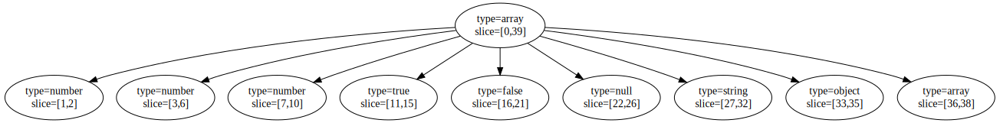

<h1 align="center">✨ Peppa PEG 🐷 ✨</h1>

<p align="center">An ultra lightweight PEG Parser in ANSI C.</p>

```
  ____                          ____  _____ ____
 |  _ \ ___ _ __  _ __   __ _  |  _ \| ____/ ___|
 | |_) / _ \ '_ \| '_ \ / _` | | |_) |  _|| |  _
 |  __/  __/ |_) | |_) | (_| | |  __/| |__| |_| |
 |_|   \___| .__/| .__/ \__,_| |_|   |_____\____|
           |_|   |_|
```

[](https://github.com/soasme/PeppaPEG/actions/workflows/check.yml)
[](https://github.com/soasme/PeppaPEG/actions/workflows/docs.yml)
[](https://www.soasme.com/PeppaPEG)

# Hello, There!

Peppa PEG is an ultra lightweight [PEG] (parsing expression grammar) parser in ANSI C.

References: [GitHub](https://github.com/soasme/PeppaPEG)
| [Project Home Page](https://soasme.com/PeppaPEG/landing.html)
| [Project Documentation Pages](https://soasme.com/PeppaPEG/).

# Usage

## Copy `peppa.h` / `peppa.c`

Peppa PEG has a header file and a C file, so you can add
it to your project by copying files "peppa.h" and "peppa.c".

Peppa PEG assumes your project is ANSI C (C89, or C90) compatible.

Once copied, add include macro and start using the library!

```
#include "peppa.h"
```

## Load Grammar

In Peppa PEG, grammar syntax can be loaded from a string. Below is an example of JSON grammar syntax.

```c
P4_Grammar* grammar = P4_LoadGrammar(
    "@lifted\n"
    "entry = &[\\u0001-\\U0010ffff] value ![\\u0001-\\u0010ffff];\n"

    "@lifted\n"
    "value = object / array / string / number / true / false / null;\n"

    "object = \"{\" (item (\",\" item)*)? \"}\";\n"
    "item = string \":\" value;\n"

    "array = \"[\" (value (\",\" value)*)? \"]\";\n"

    "@tight\n"
    "string = \"\\\"\" ([\\u0020-\\u0021] / [\\u0023-\\u005b] / [\\u005d-\\U0010ffff] / escape )* \"\\\"\";\n"

    "true = \"true\";\n"
    "false = \"false\";\n"
    "null = \"null\";\n"

    "@tight @squashed\n"
    "number = minus? integral fractional? exponent?;\n"

    "@tight @squashed @lifted\n"
    "escape = \"\\\\\" (\"\\\"\" / \"/\" / \"\\\\\" / \"b\" / \"f\" / \"n\" / \"r\" / \"t\" / unicode);\n"

    "@tight @squashed"
    "unicode = \"u\" ([0-9] / [a-f] / [A-F]){4};\n"

    "minus = \"-\";\n"
    "plus = \"+\";\n"

    "@squashed @tight\n"
    "integral = \"0\" / [1-9] [0-9]*;\n"

    "@squashed @tight\n"
    "fractional = \".\" [0-9]+;\n"

    "@tight"
    "exponent = i\"e\" (plus / minus)? [0-9]+;\n"

    "@spaced @lifted\n"
    "whitespace = \" \" / \"\\r\" / \"\\n\" / \"\\t\";\n"
);
```

## Parse

In Peppa PEG, the input can be parsed via `P4_Parse`:

```
P4_Source* source = P4_CreateSource("[1,2.0,3e1,true,false,null,\"xyz\",{},[]]", "entry");
P4_Parse(grammar, source);
```

If success, the parsed source will contain an AST:



You can traverse the parse tree. For example, the below function
outputs the parse tree into JSON format:

```
P4_Node* root = P4_GetSourceAST(source);
P4_JsonifySourceAst(stdout, root);
```

```
[
    {"slice":[0,39],"type":"array","children":[
        {"slice":[1,2],"type":"number"},
        {"slice":[3,6],"type":"number"},
        {"slice":[7,10],"type":"number"},
        {"slice":[11,15],"type":"true"},
        {"slice":[16,21],"type":"false"},
        {"slice":[22,26],"type":"null"},
        {"slice":[27,32],"type":"string"},
        {"slice":[33,35],"type":"object"},
        {"slice":[36,38],"type":"array"}
    ]}
]
```


Read the documentation here: <https://soasme.com/PeppaPEG/>.

# Peppy Hacking Peppa PEG!

## Test

Peppa PEG test requires downloading the test framework Unity:

```bash
$ git submodule init
$ git submodule update
```

Assume you have `cmake` and `gcc` installed.

```bash
(root) $ mkdir -p build
(root) $ cd build
(build) $ cmake ..
(build) $ make check
...
100% tests passed, 0 tests failed
```

If valgrind is installed, you can also run the test along with memory leak check.

```bash
(root) $ mkdir -p build
(root) $ cd build
(build) $ cmake -DENABLE_VALGRIND=ON ..
(build) $ make check
```

If you feel having a testing environment is hard, try docker:

```bash
$ docker run --rm -v `pwd`:/app -it ubuntu:latest bash
# apt-get install gcc gdb valgrind make cmake python3 python3-venv python3-pip doxygen
# mkdir -p build && cd build && cmake .. && make check
```

## Docs

Peppa PEG docs can be built via doxygen:

```bash
(root) $ cd build
(build) $ rm -rf docs && make docs
```

The outputs are stored on `build/docs`.

## Examples

* Write an INI Parser using Peppa PEG: [ini.h](examples/ini.h), [ini.c](examples/ini.c).
* Write a Mustache Parser using Peppa PEG: [mustache.h](examples/mustache.h).
* Write a JSON Parser using Peppa PEG: [json.h](examples/json.h).
* Write a Calculator Parser using Peppa PEG: [calc.h](examples/calc.h), [calc.c](examples/calc.c).
* Write a [Dot](https://graphviz.org/doc/info/lang.html) parser using Peppa PEG: [dot.h](examples/dot.h).

Made with ❤️  by [Ju](https://github.com/soasme).

[PEG]: https://en.wikipedia.org/wiki/Parsing_expression_grammar
